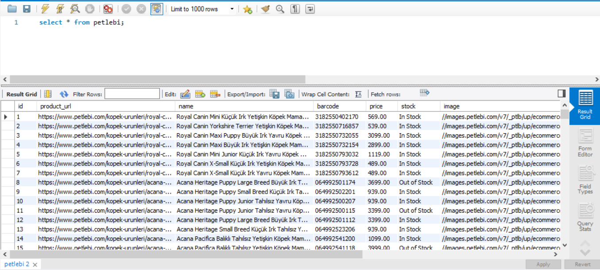
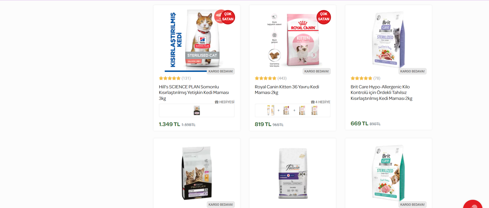

# Petlebi Web Scraping & Database Project

<p align="center">
  
  
</p>

## 📝 Overview

This project is a comprehensive web scraping and database management system that collects pet product information from the Petlebi website and stores it in a structured MySQL database. The system is designed with modularity, error handling, and scalability in mind.

## 🔍 Features

- **Efficient Web Scraping**: Collects data from 220+ product pages
- **Comprehensive Data Extraction**: Captures product names, prices, stock status, barcodes, descriptions, and images
- **Robust Database Integration**: Stores all product information in a well-structured MySQL database
- **Error Handling**: Includes comprehensive error management for network and parsing issues
- **Configurable Settings**: Easily adjust scraping parameters and database connections
- **Data Analysis Capabilities**: Generate statistics about collected products

## 🛠️ Project Structure
```
petlebi-scraper/
├── config.py            # Configuration settings
├── database.py          # Database connection and operations
├── scraper.py           # Web scraping functionality
├── logger.py            # Logging system
├── error_handler.py     # Error management
├── main.py              # Main program flow
├── petlebi_create.sql   # SQL schema definition
├── async_scraper.py     # (Optional) Asynchronous scraping
└── README.md            # This file
```
## 📋 Requirements

- Python 3.7+
- Required Python packages:
- beautifulsoup4>=4.9.3
- requests>=2.25.1
- mysql-connector-python>=8.0.26
- lxml>=4.6.3
- MySQL Server 5.7+ or MariaDB 10.3+

## 🚀 Installation

1. Clone this repository:
 ```
 git clone https://github.com/yourusername/petlebi-scraper.git
 cd petlebi-scraper
```
Install the required dependencies:
```
pip install -r requirements.txt
```
Set up your MySQL database and update the configuration:

- Create a MySQL database (or let the script create one for you)
- Edit the database connection details in config.py
## 💻 Usage
- Basic Usage:
- Run the main program which will scrape products and save them to the database:
```
python main.py
```
- Command Line Options
- The program supports several command-line arguments:
## Scrape data only (don't import to database)
```
python main.py --scrape --pages 10 --output products.json
```
## Import data to database only
```
python main.py --import --input products.json --db-name petlebidb
```
## Run with debug logs
```
python main.py --debug
```
## Specify custom database credentials
```
python main.py --host localhost --port 3306 --user root --password mypassword
```
## Using the Asynchronous Scraper (Advanced)
- For faster scraping of large datasets:
```
python async_main.py --pages 50 --concurrency 5
```
## 📊 Database Schema
- The database schema includes a single table named petlebi with the following structure:
ColumnTypeDescriptionidINTPrimary key, auto-incrementproduct_urlVARCHAR(255)URL of the product pagenameVARCHAR(255)Product namebarcodeVARCHAR(255)Product barcodepriceDECIMAL(10,2)Product pricestockVARCHAR(255)Stock statusimageVARCHAR(255)URL to product imagedescriptionTEXTProduct descriptionskuVARCHAR(255)Stock keeping unitcategoryVARCHAR(255)Product categorybrandVARCHAR(255)Product brand
## 🧩 Architecture
- The project follows a modular architecture with clear separation of concerns:

- Configuration Module: Centralizes all settings
- Database Module: Handles database connections and operations
- Scraper Module: Manages web scraping operations
- Error Handler: Provides robust error management
- Logger: Tracks system activity and errors
- Main Program: Orchestrates the overall process flow

## 📝 License
This project is licensed under the MIT License - see the LICENSE file for details.

## 🤝 Contributing
Contributions are welcome! Please feel free to submit a Pull Request.

## Fork the repository
- Create your feature branch (git checkout -b feature/amazing-feature)
- Commit your changes (git commit -m 'Add some amazing feature')
- Push to the branch (git push origin feature/amazing-feature)
- Open a Pull Request
